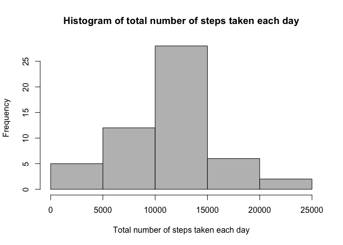
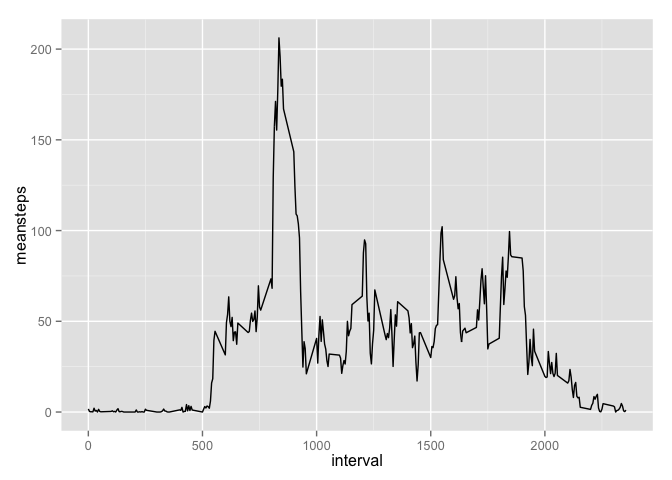
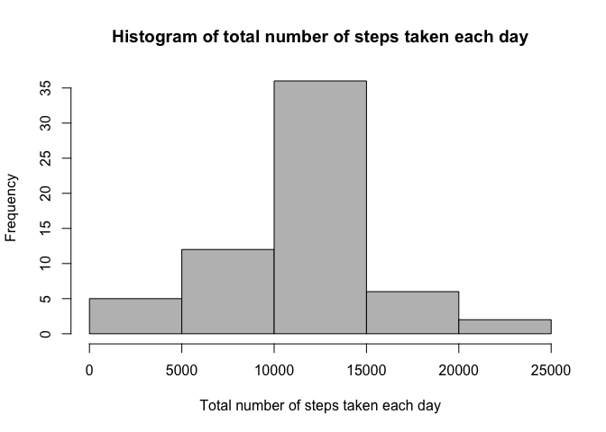
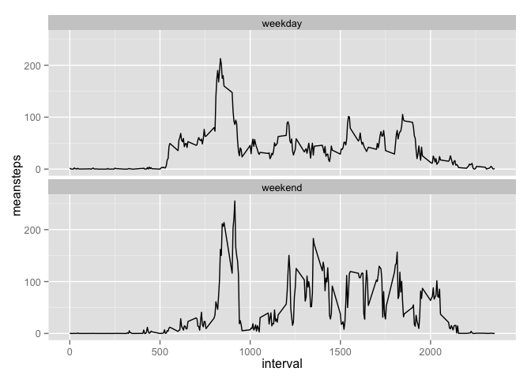

# Reproducible Research: Peer Assessment 1

## Introduction
This reproducable research is related to the Peer Assessment 1 Course Project form the Coursera Course "Reproducible Research". For more details read the respective markdown "README.md".
In order to create this reproducable research some r libraries has been used. Make sure you have the following libraries installed in your r environment when reproducing this research. 
You will see in the different code chunks which library has been used.


```r
library(plyr)
library(ggplot2)
library(dplyr)
```

## Motivation
It is now possible to collect a large amount of data about personal movement using activity monitoring devices such as a Fitbit, Nike Fuelband, or Jawbone Up. These type of devices are part of the "quantified self" movement -- a group of enthusiasts who take measurements about themselves regularly to improve their health, to find patterns in their behavior, or because they are tech geeks. But these data remain under-utilized both because the raw data are hard to obtain and there is a lack of statistical methods and software for processing and interpreting the data.  

This assignment makes use of data from a personal activity monitoring device. This device collects data at 5 minute intervals through out the day. The data consists of two months of data from an anonymous individual collected during the months of October and November, 2012 and include the number of steps taken in 5 minute intervals each day.  

##Data

The data for this assignment can be downloaded from the course web site:

Dataset: [Activity monitoring data](https://d396qusza40orc.cloudfront.net/repdata%2Fdata%2Factivity.zip)  [52K]

The variables included in this dataset are:

- steps: Number of steps taking in a 5-minute interval (missing values are coded as NA)

- date: The date on which the measurement was taken in YYYY-MM-DD format

- interval: Identifier for the 5-minute interval in which measurement was taken

The dataset is stored in a comma-separated-value (CSV) file and there are a total of 17,568 observations in this dataset.

## Loading and preprocessing the data
Show any code that is needed to  

1. Load the data (i.e. read.csv())


```r
unzip("activity.zip")
data <- read.csv("activity.csv")

# show some example records which have been loaded into r
head(data)
```

```
##   steps       date interval
## 1    NA 2012-10-01        0
## 2    NA 2012-10-01        5
## 3    NA 2012-10-01       10
## 4    NA 2012-10-01       15
## 5    NA 2012-10-01       20
## 6    NA 2012-10-01       25
```

2. Process/transform the data (if necessary) into a format suitable for your analysis

```r
# convert the factor field date in a date field for later use
data$date <- as.Date(data$date ,
                     "%Y-%m-%d"
                     )
# show details from the data dataframe and its variables
str(data)
```

```
## 'data.frame':	17568 obs. of  3 variables:
##  $ steps   : int  NA NA NA NA NA NA NA NA NA NA ...
##  $ date    : Date, format: "2012-10-01" "2012-10-01" ...
##  $ interval: int  0 5 10 15 20 25 30 35 40 45 ...
```

## What is mean total number of steps taken per day?
For this part of the assignment, you can ignore the missing values in the dataset.  

1. Make a histogram of the total number of steps taken each day  


```r
# use of plyr library in order to aggregate some variables
library(plyr)

# aggregation of the steps taken each day. Calculation of the mean and the sum for each day. Since we need to ignore the missing values in the dataset the "na.rm = TRUE" parameter has not been used for the sum and mean function 
sumdata <- ddply(data, 
                 c("date"), 
                 summarise,
                 sumsteps    = sum(steps),
                 meansteps   = mean(steps)
                 )

# creation of the histogram for the total steps taken each day
hist(sumdata$sumsteps,
     col ="grey",
     main="Histogram of total number of steps taken each day", 
     xlab="Total number of steps taken each day"
     )
```

 

2. Calculate and report the mean and median total number of steps taken per day  


```r
# analyse of the sumdata dataframe with the median and mean values for the total number of steps (sumsteps) taken each day
summary(sumdata)
```

```
##       date               sumsteps       meansteps      
##  Min.   :2012-10-01   Min.   :   41   Min.   : 0.1424  
##  1st Qu.:2012-10-16   1st Qu.: 8841   1st Qu.:30.6979  
##  Median :2012-10-31   Median :10765   Median :37.3785  
##  Mean   :2012-10-31   Mean   :10766   Mean   :37.3826  
##  3rd Qu.:2012-11-15   3rd Qu.:13294   3rd Qu.:46.1597  
##  Max.   :2012-11-30   Max.   :21194   Max.   :73.5903  
##                       NA's   :8       NA's   :8
```

```r
# Calculation of the mean of the total number of steps taken each day
mean(sumdata$sumsteps,
     na.rm = TRUE
     )
```

```
## [1] 10766.19
```

```r
# Calculation of the median of the total number of steps taken each day
median(sumdata$sumsteps,
     na.rm = TRUE
     )
```

```
## [1] 10765
```

## What is the average daily activity pattern?
1. Make a time series plot (i.e. type = "l") of the 5-minute interval (x-axis) and the average number of steps taken, averaged across all days (y-axis)  


```r
# use of plyr library in order to aggregate some variables
library(plyr)

# aggregation of the steps per interval. Calculation of the mean and the sum for each 5-minute interval
meandata <- ddply(data,
                  c("interval"), 
                  summarise,
                  sumsteps    = sum(steps),
                  meansteps   = mean(steps, 
                                     na.rm = TRUE
                                     )
                  )
# use of ggplot2 library in order to create some advanced graphs
library(ggplot2)

# creation of a ggplot2 line graph withe the 5 minute interval for the x-axis and the meansteps for the y-axis
g <- ggplot(meandata,
            aes(interval, meansteps)
            ) + geom_line() 
print(g)
```

 

2. Which 5-minute interval, on average across all the days in the dataset, contains the maximum number of steps?  

*According to the ggplot2 line graph the maximum of the average steps per interval is slightliy over 200 and the interval is slightly 800. In order to get the exact values we will manuel calculate it.*


```r
# maximum of the average steps per 5 minute interval
maxmeanstep <- max(meandata$meansteps)
maxmeanstep
```

```
## [1] 206.1698
```

```r
# the 5 minute interval with the maximum of the average steps per 5 minute interval
maxmeaninterval <- meandata[meandata$meansteps == maxmeanstep ,"interval"]
maxmeaninterval
```

```
## [1] 835
```

*The maximum of the average steps per 5 minute interval is exactly __206.1698113__ and the 5 minute interval with the maximum of the average steps is exactly __835__*

## Imputing missing values
Note that there are a number of days/intervals where there are missing values (coded as NA). The presence of missing days may introduce bias into some calculations or summaries of the data.  

1. Calculate and report the total number of missing values in the dataset (i.e. the total number of rows with NAs)  


```r
# quick view on the data data frame
summary(data)
```

```
##      steps             date               interval     
##  Min.   :  0.00   Min.   :2012-10-01   Min.   :   0.0  
##  1st Qu.:  0.00   1st Qu.:2012-10-16   1st Qu.: 588.8  
##  Median :  0.00   Median :2012-10-31   Median :1177.5  
##  Mean   : 37.38   Mean   :2012-10-31   Mean   :1177.5  
##  3rd Qu.: 12.00   3rd Qu.:2012-11-15   3rd Qu.:1766.2  
##  Max.   :806.00   Max.   :2012-11-30   Max.   :2355.0  
##  NA's   :2304
```

```r
# manual check --> get rows with NA's
data_NA <- data[!complete.cases(data),]

# number of rows
nrow(data_NA)
```

```
## [1] 2304
```

*The original data loaded has in the most granular level __2304 NA's__.*


2. Devise a strategy for filling in all of the missing values in the dataset. The strategy does not need to be sophisticated. For example, you could use the mean/median for that day, or the mean for that 5-minute interval, etc.  

*The strategy is to copy the mean steps values of the 5 minute intervals to those intervals who do have NA*

3. Create a new dataset that is equal to the original dataset but with the missing data filled in.  


```r
# make a clone of the oroginal data dataframe with the NA's
cleandata <- data

# show some example records of the clone with NA
head(cleandata)
```

```
##   steps       date interval
## 1    NA 2012-10-01        0
## 2    NA 2012-10-01        5
## 3    NA 2012-10-01       10
## 4    NA 2012-10-01       15
## 5    NA 2012-10-01       20
## 6    NA 2012-10-01       25
```

```r
# copy the mean steps values of the 5 minute intervals to those intervals who do have NA*
cleandata[is.na(cleandata$steps) & cleandata$interval == meandata$interval,1] <- meandata$meansteps

# manual check of the cleaned dataframe --> get rows with NA's
data_NA <- cleandata[!complete.cases(cleandata),]

# number of rows
nrow(data_NA)
```

```
## [1] 0
```

```r
# show some example records of the cleaned data frame without NA's
head(cleandata)
```

```
##       steps       date interval
## 1 1.7169811 2012-10-01        0
## 2 0.3396226 2012-10-01        5
## 3 0.1320755 2012-10-01       10
## 4 0.1509434 2012-10-01       15
## 5 0.0754717 2012-10-01       20
## 6 2.0943396 2012-10-01       25
```

4. Make a histogram of the total number of steps taken each day and Calculate and report the mean and median total number of steps taken per day. Do these values differ from the estimates from the first part of the assignment? What is the impact of imputing missing data on the estimates of the total daily number of steps?  


```r
# use of plyr library in order to aggregate some variables
library(plyr)

# aggregation of the steps taken each day from the cleaned data frame. Calcuation of the mean and the sum for each 5-minute interval. Since in the cleaned dataset there are no missing values (NA) the "na.rm = TRUE" parameter has not been used for the sum and mean function 
cleansumdata <- ddply(cleandata, c("date"), summarise,
               sumsteps    = sum(steps),
               meansteps   = mean(steps)
)

# creation of the histogram for the total steps taken each day from the cleaned data frame
hist(cleansumdata$sumsteps,
     col ="grey",
     main="Histogram of total number of steps taken each day", 
     xlab="Total number of steps taken each day"
     )
```

 

*Generally the histograms look the same but:*  
*The histogram of the total steps taken each day __with__ NA's are slightly less for each bar compared with the histogram of the total steps taken each day __without__ NA's.*


```r
#quick view on the original dataframe with NA's
summary(sumdata)
```

```
##       date               sumsteps       meansteps      
##  Min.   :2012-10-01   Min.   :   41   Min.   : 0.1424  
##  1st Qu.:2012-10-16   1st Qu.: 8841   1st Qu.:30.6979  
##  Median :2012-10-31   Median :10765   Median :37.3785  
##  Mean   :2012-10-31   Mean   :10766   Mean   :37.3826  
##  3rd Qu.:2012-11-15   3rd Qu.:13294   3rd Qu.:46.1597  
##  Max.   :2012-11-30   Max.   :21194   Max.   :73.5903  
##                       NA's   :8       NA's   :8
```

```r
#quick view on the original dataframe without NA's
summary(cleansumdata)
```

```
##       date               sumsteps       meansteps      
##  Min.   :2012-10-01   Min.   :   41   Min.   : 0.1424  
##  1st Qu.:2012-10-16   1st Qu.: 9819   1st Qu.:34.0938  
##  Median :2012-10-31   Median :10766   Median :37.3826  
##  Mean   :2012-10-31   Mean   :10766   Mean   :37.3826  
##  3rd Qu.:2012-11-15   3rd Qu.:12811   3rd Qu.:44.4826  
##  Max.   :2012-11-30   Max.   :21194   Max.   :73.5903
```

```r
#calculation of the mean from the original dataframe with NA's
mean <- mean(sumdata$sumsteps,
     na.rm = TRUE
     )

mean
```

```
## [1] 10766.19
```

```r
#calculation of the mean from the original dataframe with NA's
cleanmean <- mean(cleansumdata$sumsteps)

cleanmean
```

```
## [1] 10766.19
```

```r
#calculation of the median from the original dataframe with NA's
median <- median(sumdata$sumsteps,
       na.rm = TRUE
     )

median
```

```
## [1] 10765
```

```r
#calculation of the mean from the original dataframe without NA's
cleanmedian <- median(cleansumdata$sumsteps)

cleanmedian
```

```
## [1] 10766.19
```

*The mean of the aggregated data with NA's __( 1.0766189\times 10^{4} )__ and without NA's __( 1.0766189\times 10^{4} )__ are exactly the same.* 

*The median of the aggregated data with NA's __( 10765 )__ and without NA's __( 1.0766189\times 10^{4} )__ are nearly the same with just a little (very little) difference.*

*In the summaries of the aggregated data with NA's and without NA's you can see more detials about the the bigger differences.*

## Are there differences in activity patterns between weekdays and weekends?
For this part the weekdays() function may be of some help here. Use the dataset with the filled-in missing values for this part.  

1. Create a new factor variable in the dataset with two levels -- "weekday" and "weekend" indicating whether a given date is a weekday or weekend day.  


```r
# use of plyr library in order to calculate and add new variable
library(dplyr)
```


```r
# new data frame as a copy of the cleandata data frame and the calculation and mutation of the the variable weekday
weekdata <- mutate(cleandata,
                  weekday = ifelse(weekdays(date) %in% c("Samstag","Sontag"), "weekend", "weekday"))

# show some examples od the new weekdata data frame with the new variable weekday
head(weekdata)
```

```
##       steps       date interval weekday
## 1 1.7169811 2012-10-01        0 weekday
## 2 0.3396226 2012-10-01        5 weekday
## 3 0.1320755 2012-10-01       10 weekday
## 4 0.1509434 2012-10-01       15 weekday
## 5 0.0754717 2012-10-01       20 weekday
## 6 2.0943396 2012-10-01       25 weekday
```

2. Make a panel plot containing a time series plot (i.e. type = "l") of the 5-minute interval (x-axis) and the average number of steps taken, averaged across all weekday days or weekend days (y-axis). The plot should look something like the following, which was created using simulated data:  


```r
# use of plyr library in order to aggregate some variables
library(plyr)

# aggregation of the steps taken each day from the cleaned data frame with weekdays. Calcuation of the mean and the sum for each 5-minute interval and weekday. Since in the cleaned dataset there are no missing values (NA) the "na.rm = TRUE" parameter has not been used for the sum and mean function 
cleanmeandata <- ddply(weekdata, 
                  c("interval","weekday"), 
                  summarise,
                  sumsteps    = sum(steps),
                  meansteps   = mean(steps)
                  )

# use of ggplot2 library in order to create some advanced graphs
library(ggplot2)

# creation of a multipanle ggplot2 line graph withe the 5 minute interval for the x-axis and the meansteps for the y-axis. Additionaly the weekdays is used for the two sections of the line graph.
g <- ggplot(cleanmeandata, aes(interval,meansteps)) + geom_line() + facet_wrap( ~ weekday, nrow= 2)

print(g)
```

 
